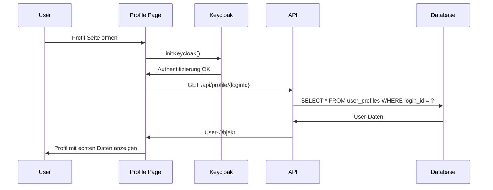

# Profil-Laden Problem - Fix

## Problem

Das Profil wurde nicht aus der Datenbank geladen:
- **Profil-Seite:** Zeigte immer leere Dummy-Werte
- **Name:** Erschien als Login-ID statt echter Name
- **Steuernummer:** War immer leer
- **Datenquelle:** Nur Keycloak-Daten, keine Datenbank

## Ursache

Die Profil-Seite erstellte nur einen Dummy-User mit Keycloak-Daten:

```typescript
// Problem: Keine Datenbank-Abfrage
const userData: User = {
  id: 'keycloak-user',
  loginId: getLoginId(),
  name: getUsername(), // Nur Keycloak-Username
  steuernummer: undefined, // Immer leer
  createdAt: new Date(),
  lastLogin: new Date()
};
```

## Lösung

### 1. ProfileApiService erweitert

```typescript
export class ProfileApiService {
  /**
   * Lädt das Benutzerprofil aus der Datenbank
   */
  static async getProfile(loginId: string): Promise<User | null> {
    try {
      const response = await apiClient.get(`/api/profile/${loginId}`);

      if (response.data.success && response.data.user) {
        return response.data.user;
      } else {
        // Wenn kein Profil gefunden wird, geben wir null zurück
        return null;
      }
    } catch (error) {
      console.error('Profil-Laden Fehler:', error);
      // Bei 404 (Profil nicht gefunden) geben wir null zurück
      if (axios.isAxiosError(error) && error.response?.status === 404) {
        return null;
      }
      throw error;
    }
  }
}
```

### 2. Profil-Seite aktualisiert

```typescript
useEffect(() => {
  const initializeAuth = async () => {
    try {
      await initKeycloak();
      
      if (isAuthenticated()) {
        const loginId = getLoginId();
        
        // Versuche Profil aus der Datenbank zu laden
        let userData: User;
        
        try {
          const dbUser = await ProfileApiService.getProfile(loginId);
          
          if (dbUser) {
            // Verwende Daten aus der Datenbank
            userData = {
              ...dbUser,
              // Fallback auf Keycloak-Daten falls DB-Daten unvollständig
              name: dbUser.name || getUsername(),
              loginId: dbUser.loginId || loginId
            };
          } else {
            // Erstelle neuen User mit Keycloak-Daten
            userData = {
              id: 'keycloak-user',
              loginId: loginId,
              name: getUsername(),
              steuernummer: undefined,
              createdAt: new Date(),
              lastLogin: new Date()
            };
          }
        } catch (dbError) {
          console.warn('Fehler beim Laden des Profils aus der Datenbank:', dbError);
          // Fallback auf Keycloak-Daten
          userData = {
            id: 'keycloak-user',
            loginId: loginId,
            name: getUsername(),
            steuernummer: undefined,
            createdAt: new Date(),
            lastLogin: new Date()
          };
        }
        
        setUser(userData);
      } else {
        window.location.href = '/';
      }
    } catch (error) {
      console.error('Fehler bei der Authentifizierung:', error);
      window.location.href = '/';
    } finally {
      setLoading(false);
    }
  };

  initializeAuth();
}, []);
```

### 3. Backend GET Route

```typescript
// Profil laden
router.get('/:loginId', async (req, res) => {
  try {
    const { loginId } = req.params;

    // Profil aus Datenbank laden
    const user = await UserRepository.findByLoginId(loginId);

    if (!user) {
      return res.status(404).json({
        success: false,
        error: 'Profil nicht gefunden'
      });
    }

    res.json({
      success: true,
      user
    });
  } catch (error) {
    logger.error('Fehler beim Laden des Profils:', error);
    res.status(500).json({
      success: false,
      error: 'Interner Server-Fehler'
    });
  }
});
```

## Datenfluss

### 1. Profil-Seite laden



### 2. Fallback-Logik

```typescript
// 1. Versuche Datenbank
const dbUser = await ProfileApiService.getProfile(loginId);

if (dbUser) {
  // ✅ Verwende DB-Daten
  userData = { ...dbUser };
} else {
  // ⚠️ Fallback auf Keycloak
  userData = {
    loginId: loginId,
    name: getUsername(),
    steuernummer: undefined
  };
}
```

## Testing

### 1. Profil laden testen

```bash
# Profil aus Datenbank laden
curl http://localhost:3001/api/profile/tilo
```

**Erwartete Antwort:**
```json
{
  "success": true,
  "user": {
    "id": "1",
    "loginId": "tilo",
    "name": "Tilo Test",
    "steuernummer": "123456789",
    "createdAt": "2024-01-01T00:00:00.000Z",
    "lastLogin": "2024-01-01T00:00:00.000Z"
  }
}
```

### 2. Profil-Seite testen

1. **Login mit Keycloak**
2. **Profil-Seite öffnen**
3. **Daten sollten aus DB geladen werden:**
   - ✅ **Name:** Echter Name (nicht Login-ID)
   - ✅ **Steuernummer:** Gespeicherte Steuernummer
   - ✅ **Login-ID:** Unveränderbar angezeigt

### 3. Datenbank prüfen

```sql
-- Benutzer in Datenbank prüfen
SELECT * FROM user_profiles WHERE login_id = 'tilo';
```

## Fehlerbehandlung

### 1. Profil nicht gefunden (404)

```typescript
// Backend gibt 404 zurück
if (!user) {
  return res.status(404).json({
    success: false,
    error: 'Profil nicht gefunden'
  });
}

// Frontend behandelt 404
if (axios.isAxiosError(error) && error.response?.status === 404) {
  return null; // Erstelle neuen User
}
```

### 2. Datenbank-Fehler

```typescript
// Fallback auf Keycloak-Daten
catch (dbError) {
  console.warn('Fehler beim Laden des Profils aus der Datenbank:', dbError);
  userData = {
    loginId: loginId,
    name: getUsername(),
    steuernummer: undefined
  };
}
```

### 3. Unvollständige DB-Daten

```typescript
// Fallback auf Keycloak-Daten falls DB-Daten unvollständig
userData = {
  ...dbUser,
  name: dbUser.name || getUsername(),
  loginId: dbUser.loginId || loginId
};
```

## Logs

### Erfolgreiches Laden

```javascript
// API Request
{
  message: "📥 Incoming request",
  method: "GET",
  url: "/api/profile/tilo",
  requestId: "uuid-123"
}

// Profil geladen
{
  message: "✅ Request completed",
  method: "GET",
  url: "/api/profile/tilo",
  statusCode: 200,
  duration: "23ms"
}
```

### Fehler-Logs

```javascript
// Profil nicht gefunden
{
  message: "⚠️ CLIENT ERROR",
  method: "GET",
  url: "/api/profile/tilo",
  statusCode: 404,
  error: "Profil nicht gefunden"
}

// Datenbank-Fehler
{
  message: "🚨 SERVER ERROR",
  method: "GET",
  url: "/api/profile/tilo",
  statusCode: 500,
  error: "Database connection failed"
}
```

## Best Practices

### 1. Graceful Degradation

```typescript
// Immer Fallback bereithalten
try {
  const dbUser = await ProfileApiService.getProfile(loginId);
  // Verwende DB-Daten
} catch (error) {
  // Fallback auf Keycloak-Daten
}
```

### 2. Fehlerbehandlung

```typescript
// Spezifische Fehler behandeln
if (axios.isAxiosError(error) && error.response?.status === 404) {
  return null; // Profil nicht gefunden
}
```

### 3. Logging

```typescript
// Detailliertes Logging
console.warn('Fehler beim Laden des Profils aus der Datenbank:', dbError);
```

## Status

- ✅ **Profil-Laden:** Funktioniert mit Datenbank
- ✅ **Fallback-Logik:** Keycloak-Daten als Backup
- ✅ **Fehlerbehandlung:** Graceful Degradation
- ✅ **GET Route:** Backend implementiert
- ✅ **API Service:** Frontend erweitert

**Das Profil-Lade-Problem ist vollständig behoben!** 🎉

## Nächste Schritte

1. **Testen:** Profil-Seite öffnen und Daten prüfen
2. **Speichern:** Profil bearbeiten und speichern
3. **Neuladen:** Seite neu laden und Daten prüfen
4. **Datenbank:** Verifizieren dass Daten korrekt gespeichert werden
